# Get developer access

Create a twitter account if required from which you intend the bot to post tweets or retweet.

Visit https://developer.twitter.com and complete the steps

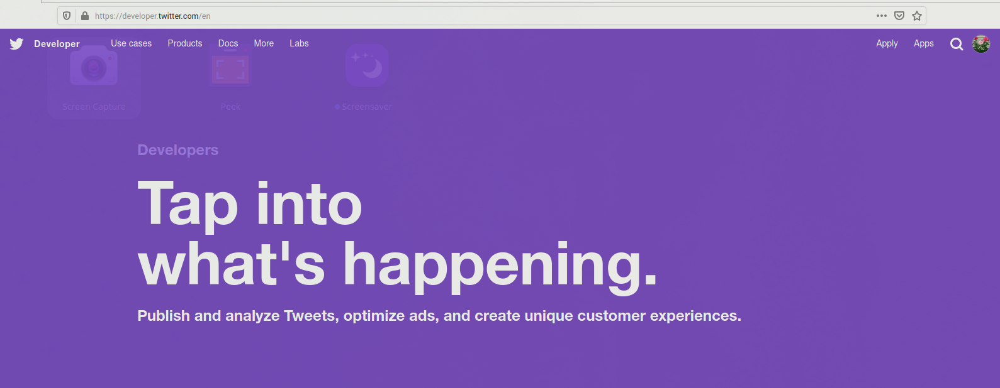
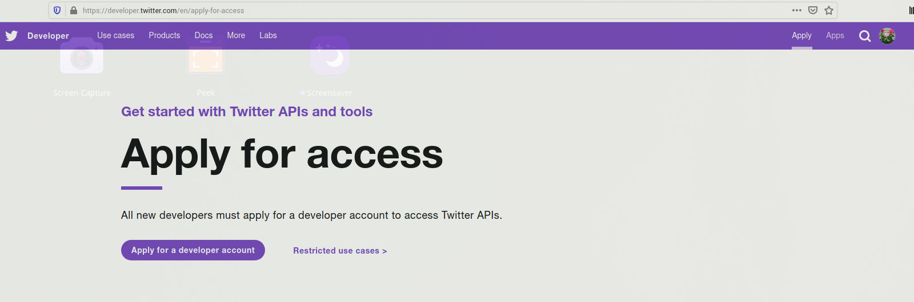

Select appropriate option from below that suits your need
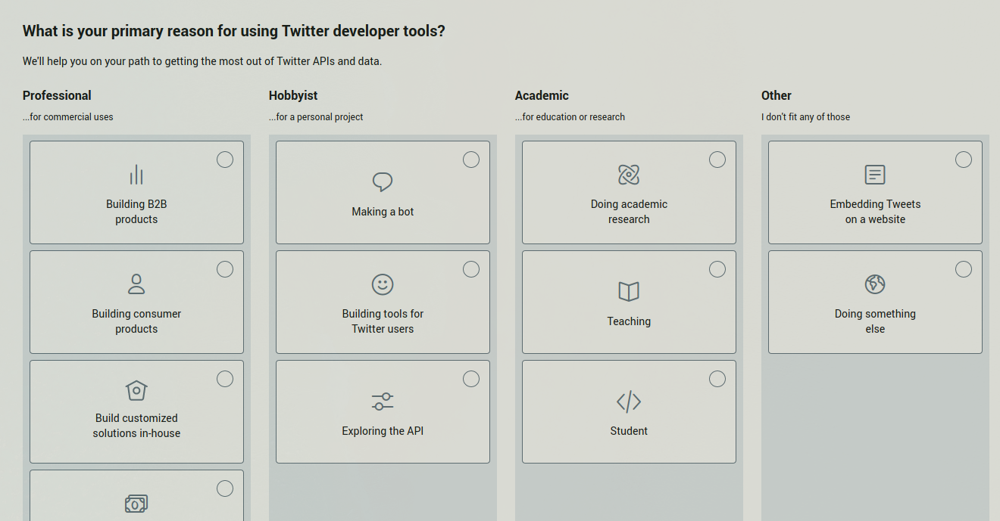

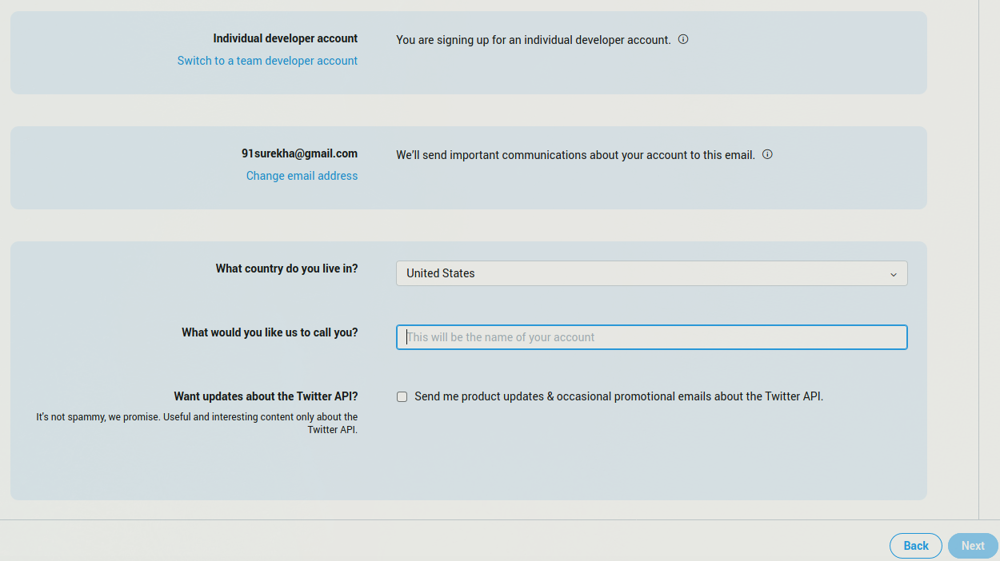

Complete the questionaire below, review, and submit the application. Twitter might contact you to verify few details or grant you developer access right away.
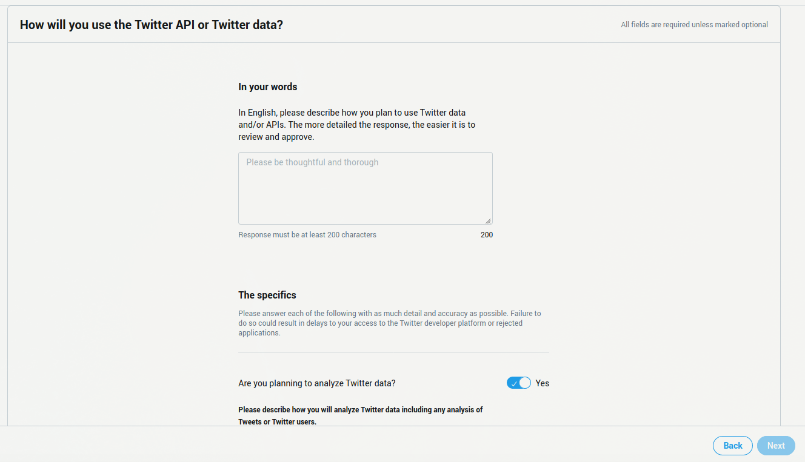

Once approved, go to `Apps` from your account, create an app and make note of API keys (`API key`, `API secret key`) which will be required to run the bot
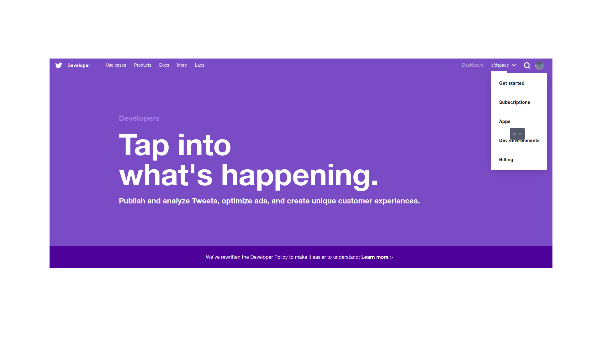

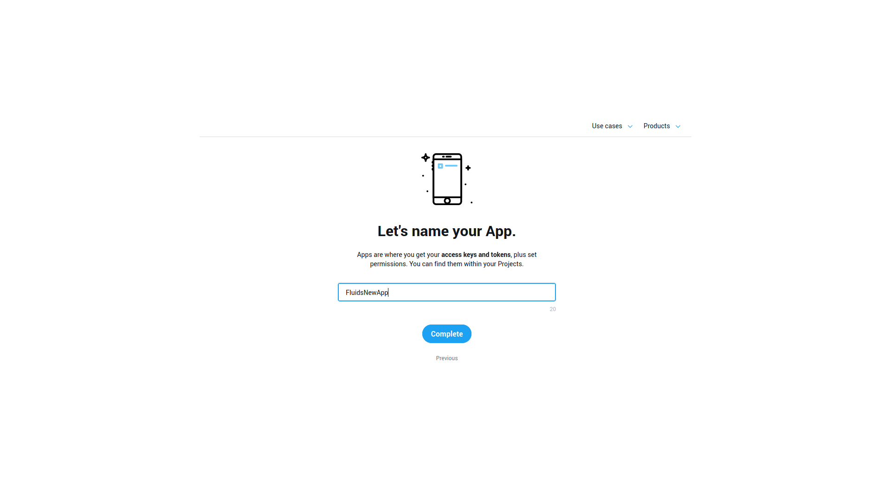

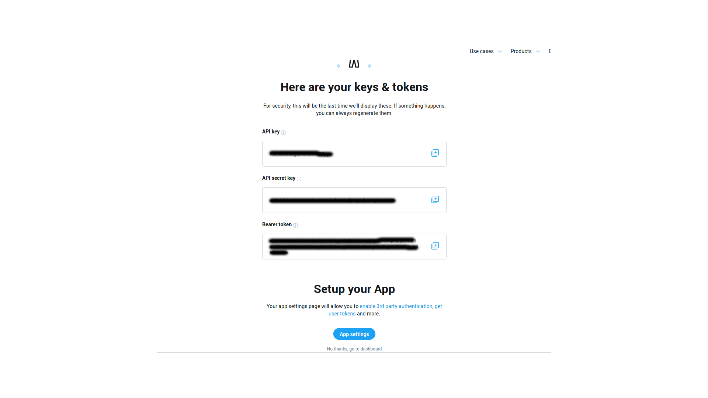

For the bot to retweet, set it `Read and Write` permissions
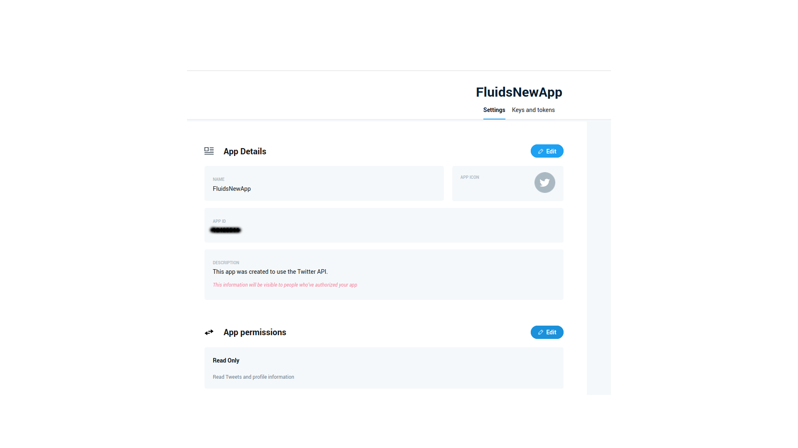
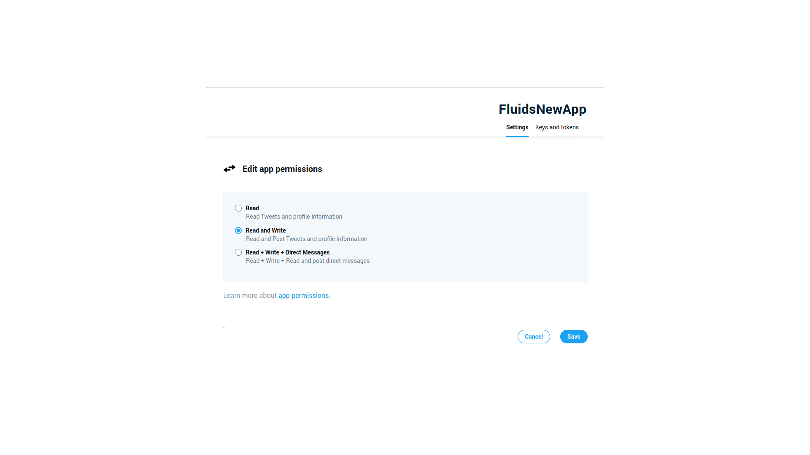

Finally generate and save `Access token` and `Access secret token`

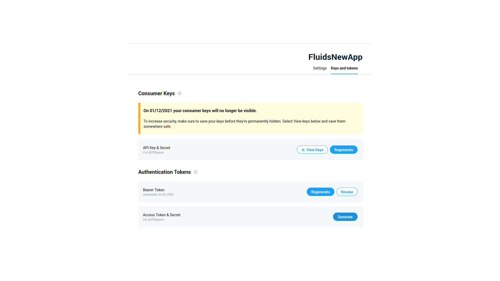
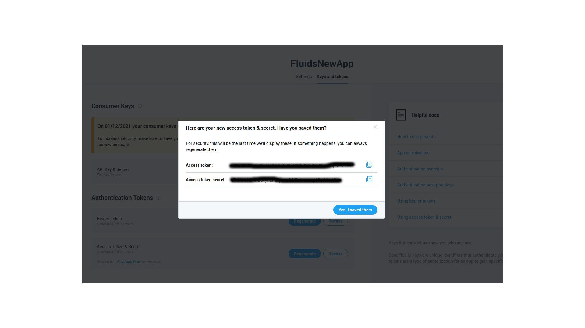